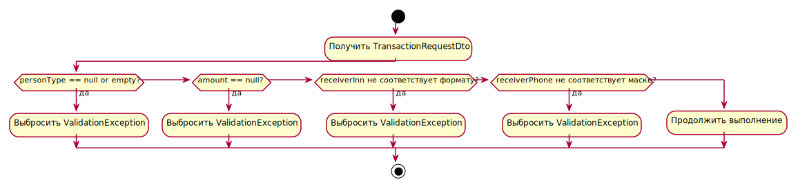

#### Class Diagram

#### Class Diagram — Категории и транзакции

#### Filter Specification API

#### Component Diagram

#### Component Diagram — Дашборды и визуализация

#### Sequence Diagram — Создание записи о транзакции

#### Sequence Diagram — Авторизация через Keycloak

#### Sequence Diagram — Генерация PDF-отчёта

#### Sequence Diagram — CRUD операций с категорией

#### Package Diagram

#### Package Diagram — Структура backend-проекта

#### Activity Diagram

#### Activity Diagram — Фильтрация транзакций

#### Exception Handling Diagram

